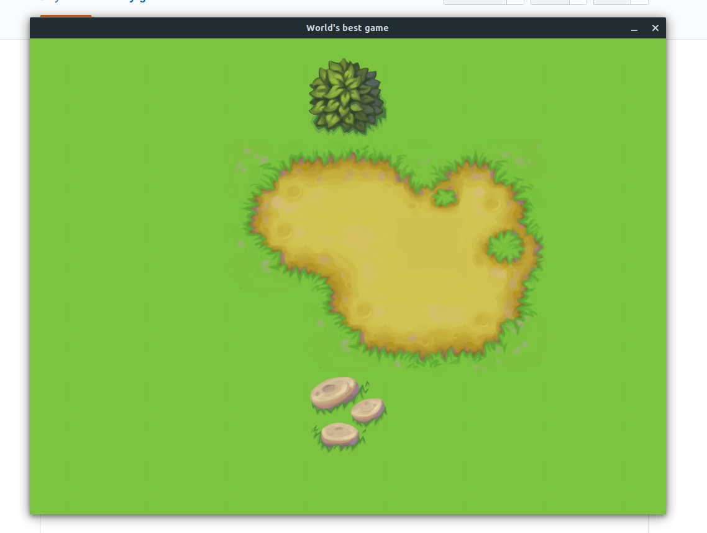

# Overview

This repo is a work-in-progress game built on a custom game engine using Rust. This is a sister repository to [https://github.com/ryanisnan/rusty-engine/](https://github.com/ryanisnan/rusty-engine/).

# Features

The game so far is very limited, and can't really even be considered a "game" yet, as there is no point, no objectives, and a very poorly defined player concept. However, as a programming exercise it has accomplished a bit:

- World loading and rendering
- Customizable asset library
- Simple X/Y scrolling

